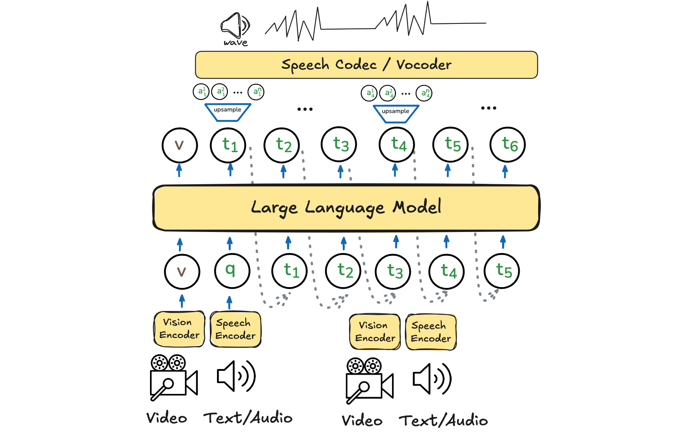

<h1 align="center">Open Omni Nexus</h1>
<p align="center">
    <!-- <a href="https://arxiv.org/abs/xxxx.xxxxx">
            
    </a>
    <br> -->
    <a href="https://huggingface.co/collections/ColorfulAI/open-omni-nexus-67ebf151b585c14129122d14">
        
    </a>
    <!-- <a href="https://huggingface.co/ColorfulAI/OpenOmni-8B-Llama3-Omni">
        
    </a>
    <a href="https://huggingface.co/ColorfulAI/OpenOmni-7B-Qwen2-Omni">
        
    </a> -->
    <br>
    <br>
    

</p>

<!--  -->

> [!IMPORTANT]
> The currently available checkpoints are undertrained and lack visual-auditory alignment data due to source constraints, which may lead to unpredictable behavior in some cases

## Updates

- `2025-04-02` **First Release [Open-Omni-Nexus](https://github.com/patrick-tssn/Open-Omni-Nexus)**. a fully open-source implementation of a GPT-4o-like speech-to-speech video understanding model.

**Table of Contents**

- [Introduction](#introduction)
- [Prior Knowledge](#prior-knowledge)
- [Training](#training)
  - [Installation](#installation)
  - [Data Preparation](#data-preparation)
  - [Backbone Preparation](#pretrained-backbone-preparation)
  - [Start Training](#start-training)
- [Usage](#usage)
- [Roadmap](#roadmap)
- [Acknowledgement](#acknowledgement)
- [Citation](#citation)

## Introduction

Since there isn't a fully open-sourced repository for a GPT-4o-like end-to-end omni model with complete training code and data, I've made this repository public in the hope that it will be useful to the community. The entire code logic is based on LLaVA.

## Prior Knowledge

Must Read
- [Visual Instruction Tuning](https://arxiv.org/abs/2304.08485), `visual post-training`
- [LLaMA-Omni: Seamless Speech Interaction with Large Language Models](https://arxiv.org/abs/2409.06666), `speech/audio post-training`


## Training

### Installation

This codebase is tested on CUDA 11.8 and A800-80G.

```bash
conda create -n open_omni python=3.10 -y && conda activate open_omni
pip install torch==2.5.0 torchvision==0.20.0 torchaudio==2.5.0 --index-url https://download.pytorch.org/whl/cu118
pip install -e ".[train]"
pip install packaging &&  pip install ninja && pip install flash-attn==2.6.3 --no-build-isolation --no-cache-dir
pip install -r requirements.txt
```

Additionally, Install [fairseq](https://github.com/facebookresearch/fairseq) for speech units process

<details>
<summary>possible environment issues</summary>

- flash-attn install fail, try install from source: `pip install https://github.com/Dao-AILab/flash-attention/releases/download/v2.6.3/flash_attn-2.6.3+cu118torch2.4cxx11abiFALSE-cp310-cp310-linux_x86_64.whl`
- fairseq env conflict: `pip install pip==24`

</details>

### Data Preparation

**Data download**:

- Download [LLaVA-NeXT-Data](https://huggingface.co/datasets/lmms-lab/LLaVA-NeXT-Data) for visual instruction tuning
- Download [VoiceAssistant-400K](https://huggingface.co/datasets/gpt-omni/VoiceAssistant-400K) for speech instruction tuning.

You can sample a portion of these datasets or collect more data based on your computational resources.

**Data preprocess**:

- Install [CosyVoice](https://github.com/FunAudioLLM/CosyVoice) or [ChatTTS](https://github.com/2noise/ChatTTS), for speech synthesis and test speech generation. If you are interested in the process of the speech instruction synthesis, you can refer to the scripts in `preprocess/tts`
- Download [mHuBERT](https://dl.fbaipublicfiles.com/hubert/mhubert_base_vp_en_es_fr_it3.pt) and [K-means Model](https://dl.fbaipublicfiles.com/hubert/mhubert_base_vp_en_es_fr_it3_L11_km1000.bin) to `checkpoints/quantizer` for speech units generation. You can refer to the scripts in `preprocess/quantize` for the speech unit generation process. We provide processed samples from VoiceAssistant for convenience, check it [](https://huggingface.co/datasets/ColorfulAI/VoiceAssistant_units)

*optional:* In addition, to assist with visual-audio instruction tuning, we convert user queries from [LLaVA-NeXT](https://github.com/LLaVA-VL/LLaVA-NeXT) into audio using [CosyVoice](https://github.com/FunAudioLLM/CosyVoice). If you are interested in the process of the construction of audio instruction, you can refer to the scripts in `preprocess/tts`.

Data sample

```json
    {
        "id": "000000240632",
        "image": "000000240632.jpg",
        "conversations": [
            {
                "from": "human",
                "value": "<image>\n"
            },
            {
                "from": "human",
                "value": "<speech>\n"
            },
            {
                "from": "gpt",
                "value": "Hi, I am Open-Omni, the video show ...",
                "tgt_units": [497, 300, 63, ...]

            },
        ],
        "speech": [
            "000000240632_0.wav",
            "000000240632_1.wav"
        ]
    },
```

The final data is organized in the following format:

```
open_omni/inputs  
    ├── images/ # images
      └── llava-next/
        ├── ...
        └── xxxx.jpg
    ├── speech/
      ├── voiceassistant/
        ├── ...
        └── xxxx.wav
      └── interinst/
        ├── ...
        └── xxxx.wav
    └── texts/
      ├── llava_next_audio.json
      ├── llava_next_audio_units.json
      ├── voiceassistant.json
      └── voiceassistant_units.json
```

### Pretrained Backbone Preparation

- Supported LLM Backbone
    - [Qwen2-7B-Instruct](https://huggingface.co/Qwen/Qwen2-7B-Instruct)
    - [Llama-3.1-8B-Instruct](https://huggingface.co/meta-llama/Llama-3.1-8B-Instruct)
    - [LongVA-7B](https://huggingface.co/lmms-lab/LongVA-7B), for quick speech adaptation.
    - [Llama-3.1-8B-Omni](https://huggingface.co/ColorfulAI/Llama-3.1-8B-S2S-Omni), for quick visual adaptation.
- Supported Vision Encoder
    - [clip-vit-large-patch14-336](https://huggingface.co/openai/clip-vit-large-patch14-336)
- Supported Speech Encoder
    - [Whisper](https://github.com/openai/whisper)
- Miscs
    - [HiFi-GAN vocoder](https://dl.fbaipublicfiles.com/fairseq/speech_to_speech/vocoder/code_hifigan/mhubert_vp_en_es_fr_it3_400k_layer11_km1000_lj/g_00500000) with [config](https://dl.fbaipublicfiles.com/fairseq/speech_to_speech/vocoder/code_hifigan/mhubert_vp_en_es_fr_it3_400k_layer11_km1000_lj/config.json)

Place them in the `open_omni/checkpoints` directory.

```
open_omni/checkpoints  
    ├── Qwen2-7B-Instruct
    ├── Meta-Llama-3.1-8B-Instruct
    ├── clip-vit-large-patch14-336
    ├── whisper/large-v3.pt
    └── vocoder
        ├── config.json
        └── g_00500000
```

### Start Training

> [!IMPORTANT]
> **THIS IS A TRIAL**: Train OpenOmni in a single end-to-end process from LLM by creating visual-audio-speech data, then running `scripts/finetune_openomni_os.sh`.


Or enhance existing models with the ability to see, hear, and speak by:


**1. Visual instruction tuning**

<details>
<summary>We provide the default visual instruction tuning pipeline for LLMs</summary>


If you wish to use other LLMs or instruction tuning data, feel free to follow the [LLaVA-NeXT](https://github.com/LLaVA-VL/LLaVA-NeXT) pipeline. Here, we provide a pipeline to do visual instruction tuning on [Qwen2-7B-Instruct](https://huggingface.co/Qwen/Qwen2-7B-Instruct) or [Llama-3.1-8B](https://huggingface.co/meta-llama/Llama-3.1-8B-Instruct/tree/main) using the datasets [blip_laion_cc_sbu_558k](https://huggingface.co/datasets/liuhaotian/LLaVA-Pretrain), [LLaVA-NeXT-Data](https://huggingface.co/datasets/lmms-lab/LLaVA-NeXT-Data), and [ShareGPTVideo](https://huggingface.co/datasets/ShareGPTVideo/train_video_and_instruction). Feel free to adapt it to other models.

```bash
cd open_omni
bash scripts/lvlm_pretrain.sh
bash scripts/lvlm_finetune.sh
bash scripts/lvlm_dpo.sh
```

</details>


Alternatively, you can use an off-the-shelf speech model like [Llama-3.1-8B-Omni](https://huggingface.co/ColorfulAI/Llama-3.1-8B-S2S-Omni) and enhance it with visual understanding by running

```bash
bash scripts/finetune_visual.sh
```

**2. Audio/Speech instruction tuning**

Similarly, you can use an LLM or off-the-shelf visual model like [LongVA-7B](https://huggingface.co/lmms-lab/LongVA-7B) to enhace it with auditory understanding by running

```bash
bash scripts/finetune_auditory.sh
```

To assist those with limited computational resources, we also provide an off-the-shelf checkpoint. Check it out at [](https://huggingface.co/ColorfulAI/LongVA-7B-Qwen2-VoiceAssistant)

<details>
<summary>We can combine step 1 and step 2 to perform visual-audio instruction tuning simultaneously</summary>

To enhance the model's visual-audio understanding capabilities, we offer a script to fine-tune it using the a synthetic [](https://huggingface.co/datasets/ColorfulAI/LLaVA-NeXT-Speech) dataset, which convert the queries of llava-next to speech by CosyVoice dataset. This aims to improve visual-audio alignment performance. (This process takes ~140 hours on 4 A800 GPU)

> NOTE: We find that this process is more prone to collapse than audio instruction tuning alone, so we provide a model just for further study.

```bash
bash scripts/finetune_visionaudio.sh
```

For those with limited computational resources, we also provide a ready-to-use checkpoint (17500 step). You can access it here [](https://huggingface.co/ColorfulAI/LongVA-7B-Qwen2-Audio)

Try the visual-audio base model through `python -m local_demo.baseline_audio_cli --video_path local_demo/assets/water.mp4 --question_audio "local_demo/wav/water.mp4.wav"`

</details>

**3. Speech generator tuning**

For speech generation, we adopt the tuning strategy from [LLaMA-Omni](https://github.com/ictnlp/LLaMA-Omni), utilizing the connectionist temporal classification (CTC) loss to align the hidden states of the LLM with discrete speech units extracted by the HuBERT and K-means models. 

```bash
bash scritps/finetune_speechgen.sh
```

As a result, you can flexibly enhance your model to progressively approach an omni model by following one of the previous post-training steps.

## Usage

### CLI Inference

We demonstrate a usage example for our [OpenOmni-7B-Qwen2-Omni](https://huggingface.co/ColorfulAI/OpenOmni-7B-Qwen2-Omni) model, which is fine-tuned from LongVA using VoiceAssistant (100K).

```python
import os
import json
from PIL import Image
import numpy as np
import torchaudio
import torch
from decord import VideoReader, cpu
import whisper
import soundfile as sf
# fix seed
torch.manual_seed(0)

from fairseq import utils as fairseq_utils
from fairseq.models.text_to_speech.vocoder import CodeHiFiGANVocoder

from open_omni.model.builder import load_pretrained_model
from open_omni.mm_utils import tokenizer_image_speech_tokens, process_images, ctc_postprocess
from open_omni.constants import IMAGE_TOKEN_INDEX, SPEECH_TOKEN_INDEX

import warnings
warnings.filterwarnings("ignore")

# config OpenOmni
model_path = "checkpoints/OpenOmni-7B-Qwen2-Omni"
video_path = "local_demo/assets/water.mp4"
audio_path = "local_demo/wav/water.mp4.wav"
max_frames_num = 16 # you can change this to several thousands so long you GPU memory can handle it :)
gen_kwargs = {"do_sample": True, "temperature": 0.5, "top_p": None, "num_beams": 1, "use_cache": True, "max_new_tokens": 1024}
tokenizer, model, image_processor, _ = load_pretrained_model(model_path, None, "llava_s2s_qwen", device_map="cuda:0") # for llama -> llava_s2s_llama

# config vocoder
with open("checkpoints/vocoder/config.json") as f:
    vocoder_cfg = json.load(f)
vocoder = CodeHiFiGANVocoder("checkpoints/vocoder/g_00500000", vocoder_cfg).cuda()

# query input
query = "Give a detailed caption of the video as if I am blind."
query = None # comment this to use ChatTTS to convert the query to audio

#video input
prompt = "<|im_start|>system\nYou are a helpful assistant.<|im_end|>\n<|im_start|>user\n<image><|im_end|>\n<|im_start|>user\n<speech>\n<|im_end|>\n<|im_start|>assistant\n"
input_ids = tokenizer_image_speech_tokens(prompt, tokenizer, IMAGE_TOKEN_INDEX, SPEECH_TOKEN_INDEX, return_tensors="pt").unsqueeze(0).to(model.device)
vr = VideoReader(video_path, ctx=cpu(0))
total_frame_num = len(vr)
uniform_sampled_frames = np.linspace(0, total_frame_num - 1, max_frames_num, dtype=int)
frame_idx = uniform_sampled_frames.tolist()
frames = vr.get_batch(frame_idx).asnumpy()
video_tensor = image_processor.preprocess(frames, return_tensors="pt")["pixel_values"].to(model.device, dtype=torch.float16)

#audio input
# process speech for input question
if query is not None:
    import ChatTTS
    chat = ChatTTS.Chat()
    chat.load(source='local', compile=True)
    audio_path = "./local_demo/wav/" + "infer.wav"
    if os.path.exists(audio_path): os.remove(audio_path) # refresh
    if not os.path.exists(audio_path):
        wav = chat.infer(query)
        try:
            torchaudio.save(audio_path, torch.from_numpy(wav).unsqueeze(0), 24000)
        except:
            torchaudio.save(audio_path, torch.from_numpy(wav), 24000)
    print(f"Human: {query}")
  
else:
    print("Human: <audio>")
  
speech = whisper.load_audio(audio_path)
speech = whisper.pad_or_trim(speech)
speech = whisper.log_mel_spectrogram(speech, n_mels=128).permute(1, 0).to(device=model.device, dtype=torch.float16)
speech_length = torch.LongTensor([speech.shape[0]]).to(model.device)

with torch.inference_mode():
    output_ids, output_units = model.generate(input_ids, images=[video_tensor],  modalities=["video"], speeches=speech.unsqueeze(0), speech_lengths=speech_length, **gen_kwargs)
outputs = tokenizer.batch_decode(output_ids, skip_special_tokens=True)[0].strip()
print(f"Agent: {outputs}")

output_units = ctc_postprocess(output_units, blank=model.config.unit_vocab_size)
output_units = [(list(map(int, output_units.strip().split())))]
print(f"Units: {output_units}")
x = {"code": torch.LongTensor(output_units[0]).view(1,-1)}
x = fairseq_utils.move_to_cuda(x)
wav = vocoder(x, True)
output_file_path = "local_demo/wav/output.wav"
sf.write(
    output_file_path,
    wav.detach().cpu().numpy(),
    16000
)
print(f"The generated wav saved to {output_file_path}")
```


### Gradio Demo


1. Launch a controller.
```shell
python -m local_demo.controller --host 0.0.0.0 --port 10000
```

2. Launch a gradio web server.
```shell
python -m local_demo.gradio_web_server --controller http://localhost:10000 --port 8000 --model-list-mode reload --vocoder checkpoints/vocoder/g_00500000 --vocoder-cfg checkpoints/vocoder/config.json
```

**NOTE:** for llama models change `template_name` from `qwen_1_5` to `llava_llama_3` in `Line 115` in  `local_demo/gradio_web_server.py`

3. Launch a model worker.
```shell
python -m local_demo.model_worker --host 0.0.0.0 --controller http://localhost:10000 --port 40000 --worker http://localhost:40000 --model-path checkpoints/OpenOmni-7B-Qwen2-Omni --model-name llava_s2s_qwen
```

4. Visit [http://localhost:8000/](http://localhost:8000/)


https://github.com/user-attachments/assets/cc06406e-592b-4701-8780-d38a21613eee


## Roadmap

- [ ] To collect high quanlity visual-audio-speech data
- [ ] To support streaming
- [ ] To support multilingual and more voice control
- [ ] To support more LLM/Vision Encoder/Speech Encoder/Speech Coder

## Acknowledgement

- visual instruction tuning
  - [LLaVA-NeXT](https://github.com/LLaVA-VL/LLaVA-NeXT)
  - [LongVA](https://github.com/EvolvingLMMs-Lab/LongVA)
- audio/speech instruction tuning
  - [LLaMA-Omni](https://github.com/ictnlp/LLaMA-Omni)
- speech generator tuning
  - [LLaMA-Omni](https://github.com/ictnlp/LLaMA-Omni)

## Citation

If you find our repository helpful, please consider citing our new work.

```bibtex
@article{omnimmi,
    title={OmniMMI: A Comprehensive Multi-modal Interaction Benchmark in Streaming Video Contexts},
    author={Wang, Yuxuan and Wang, Yueqian and Chen, Bo and Wu, Tong and Zhao, Dongyan and Zheng, Zilong},
    journal={CVPR},
    year={2025}
}
```
